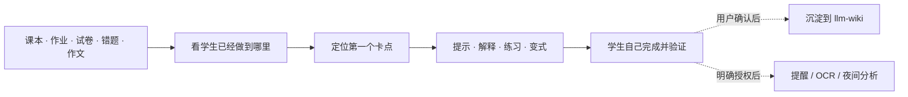

# K12 Education Skills

> 不是让 AI 替孩子做题，而是把“不会 → 看见卡点 → 学会 → 下次还能复用”变成一条可持续的学习闭环。

一个学生带着错题来，普通聊天机器人往往给出答案；下一道同类题，他还是不会。家长看到的只是“粗心”“不认真”，却不知道究竟是概念、方法、读题还是执行出了问题。一次对话结束后，真正有价值的错因、订正方法和复测结果又散掉了。

K12 Education Skills 要解决的就是这件事：让 AI 从学生已经做过的材料出发，定位第一个失效步骤；通过提示、解释和变式让学生自己完成；把确认过的结论变成下一次能继续使用的知识。需要提醒、OCR 或夜间整理时，再在明确授权后交给真实运行环境执行。

它是一个面向学生、家长和老师的 AI 学习系统：学生获得能陪自己走完学习过程的支持，家长获得基于证据的介入方式，老师获得可沉淀、可复用的教学资料。

## 我们相信：差距在学习闭环，不在标签

人们常把学生粗略分成“学霸”和“学渣”。但真正拉开差距的，通常不是一句标签，而是有没有能力持续完成这三个动作：

1. **分析现状**：知道自己到底会什么、不会什么，眼前卡在概念、方法、运算、读题还是执行。
2. **查漏补缺**：从具体作业和考试里找到知识漏洞，先补最影响下一步的那个，而不是盲目刷题。
3. **不断反馈**：根据每次作业、考试、订正和复测更新判断，调整练习、讲解和计划。

学习能力更强的学生，往往已经在脑中或在老师帮助下反复运行这套闭环；持续困难的学生并不是“不值得学”或“天生不行”，而是很难独自做到稳定观察、准确归因和及时调整。一次失败很容易被归为“粗心”，一次好成绩也很容易被误认为“已经掌握”。

这正是 AI 特别适合补位的地方：它可以耐心地比较过程、保留证据、追问第一个失效步骤、生成最小练习、记录复测结果，并在下一次带着新的事实继续调整。它不是替学生学习，而是让学生终于拥有一个持续运行的反馈系统。

## 它的价值，不是“多一个会答题的 AI”

| 常见学习对话 | K12 Education Skills |
|---|---|
| 直接给出答案，学生看懂但不会迁移 | 先看学生的过程，找第一个卡点，再按提示阶梯带他完成 |
| 用“粗心”“基础差”概括问题 | 用题目、步骤和复测证据区分概念、方法、运算、读题和执行问题 |
| 第一次就做长问卷或贴学习风格标签 | 用一份真实材料做 3–5 分钟快速测评，形成可验证的会话内初版画像 |
| 聊天结束，资料和方法散落 | 用户确认后把错因、方法、资料和成果沉淀进可检索的 Wiki |
| “帮你设提醒”却没有真正执行 | 只有安装运行环境、展示参数并获得授权后，才创建真实提醒和夜间任务 |

这套系统不追求替代老师或家长。它把原本难以持续的学习支持，变成学生、家长、老师都能看懂、能纠正、能接着做的过程。

## 一次真正有价值的学习，会发生什么



### 一个小例子

学生把一道一元一次方程和自己的过程发来：`3(x-2)=12`，写成了 `3x-2=12`。

系统不会只说“答案是 6”，而会先确认：错误发生在去括号的第一步，括号外的 3 没有同时作用到两项。它会让学生补完这一行、自己说出分配律，再做一道同结构变式。只有这一步走通，才把“分配律在解方程中漏乘”作为待验证的学习证据；而不是把一次错误写成“数学差”。

这就是它的产品承诺：**每次学习都留下一个更清楚的下一步。**

## 你会得到什么

- **学生**得到一位会看过程、会追问、会逐步放手的学习伙伴：九大学科讲题、概念理解、错题分析、写作、实验、计划、专注、复盘和兴趣探索都可以自然表达。
- **家长**得到基于证据的支持方式：知道孩子眼前需要的是讲解、练习、复测、环境支持，还是更小的启动步骤，而不是给孩子贴标签。
- **老师**可以把课堂材料、典型错因和可复用的讲解方法整理成持续生长的资料库。
- **有 Obsidian/Markdown 库的人**可以让资料、错因、方法和成果有统一结构、来源和索引，而不是把聊天记录堆进文件夹。

它不代写作业、作文或考试答案；不替代医生、心理咨询师、升学顾问、老师或监护人的专业判断。

## 第一次使用：10 分钟内从真实材料开始

### 1. 把下面整段发给 AI 安装日常模块

```text
请帮我安装以下两个模块：
k12-learning：https://github.com/MingStudentSE/k12-education-skills/tree/main/skills/k12-learning
llm-wiki：https://github.com/MingStudentSE/k12-education-skills/tree/main/skills/llm-wiki
```

你不需要克隆仓库、复制文件或选择几十个功能名；AI 根据宿主自行处理安装。

### 2. 拿出一份真实材料

课本页、作业、错题、试卷中的代表题、作文片段或实验记录都可以。把材料和学生自己的过程一起发出：

```text
我是第一次使用，这是我最近的学习材料和自己的过程。
请先基于材料做一次 3–5 分钟快速测评，不做全面测评，也不要让我填长问卷。
形成一份有证据、带置信度的初版学习 DNA，然后马上用这份材料带我完成一个真实学习动作。
如果要跨会话保存画像，请在完成第一个动作后再单独问我。
```

系统最多补问材料无法判断的年级和当前目标；一旦能看出一个优势、一个首要卡点和一个下一步，就停止测评，开始学习。没有材料也没关系：说出年级和一个“学过但拿不准”的知识点，它会用一道微题启动。

### 3. 以后只需自然描述目标

```text
这是题目和我的过程。先找第一个出问题的步骤，只给一级提示；我还不会时再逐步增加提示。
```

```text
这是我做错的题和正确解析。先找第一个错步，追到可训练的原因，再出一道变式题验证。
```

```text
这是我的作文。每个维度只指出最值得改的一点，示范一小段，不要重写全文。
```

完整的首次、日常、家长和各学科话术见 [K12 学习系统用户指南](skills/k12-learning/references/system-user-guide.md)。

## 让学习积累下来：llm-wiki

学习不是每次从零开始。`llm-wiki` 用来保存**已经确认**的资料、错因、方法和成果，并让它们以后能被查到、复用和修正。

### 你可以这样开始

```text
我想新建一个学习 Wiki。请先用通俗语言说明结构和计划，等我确认后再创建。
```

```text
我有一个正在使用的 Obsidian/Markdown 知识库。请先盘点结构并给增量适配计划；不要批量改名、搬空或覆盖已有笔记。
```

### 日常用法

```text
把这份资料入我的 Wiki。保留原始材料，先展示会新增或更新哪些页面，再执行。
```

```text
把刚才已经确认的错因、订正方法和复测题写入我的 Wiki。只传本次需要的最小内容，写入前展示目标文件和变更。
```

```text
在我的 Wiki 里找与“函数单调性”相关的笔记和错因；只返回本次复习需要的摘要。
```

如果任务确实需要 Obsidian 原生能力（Bases、CLI、附件嵌入等），系统会先检查官方 `kepano/obsidian-skills`；缺失时自动尝试安装。网络失败时不阻塞，继续使用普通 Markdown/Wikilink 流程。完整的入库、查询、体检与确认边界见 [Wiki 用户指南](skills/k12-learning/references/system-user-guide.md#wiki-怎么用)。

## 当你需要“真的执行”：自动化是可选模块

提醒、OCR、夜间错题分析和看板不应该只是口头承诺。需要时再安装：

```text
请帮我安装 k12-automation：https://github.com/MingStudentSE/k12-education-skills/tree/main/skills/k12-automation
```

然后可以说：

```text
每天 20:30 提醒我复习 15 分钟英语单词。创建前先展示渠道、频率、时区和下一次触发时间，等我确认后再创建。
```

```text
请帮我启用夜间错题分析。先用 mock 模式验证，再说明真实运行会读取什么、输出到哪里，以及如何停用和删除。
```

没有可用运行环境时，系统只给出计划，不会声称任务已经创建。

## 你的资料由你控制

- 默认只使用当前对话中提供的材料。
- 初版学习 DNA 默认只在当前会话；跨会话保存前会单独询问。
- 写 Wiki、创建提醒、OCR 外发、夜间分析和外部模型调用都是独立确认项。
- 你可以查看、更正、删除学习档案，或随时说“这次不要保存”。
- 不记录身份证件、住址、电话、账户、医疗诊断、家庭纠纷或财务细节。

完整规则见 [安全与隐私基线](SECURITY_BASELINE.md)。

## 这个系统如何组织

日常用户通常只需要前两个模块：

| 模块 | 负责什么 | 什么时候需要 |
|---|---|---|
| [`k12-learning`](skills/k12-learning/) | 九大学科答疑、概念、错题、写作、实验、计划、专注、复盘与兴趣探索 | 日常学习的默认入口 |
| [`llm-wiki`](skills/llm-wiki/) | 建库、接入、资料入库、知识查询、索引和健康检查 | 想让已确认知识持续积累时 |
| [`k12-automation`](skills/k12-automation/) | 真正的提醒、OCR、夜间错题分析和看板 | 明确需要真实执行时 |
| [`k12-skill-studio`](skills/k12-skill-studio/) | 创建/审查内部方法、质量评分和回归治理 | 仅维护者 |

四个模块不是把能力拆碎给用户选，而是四条稳定边界：**教学判断、知识沉淀、真实执行、系统维护**。详细设计见 [四模块架构](docs/architecture.md)。

## 给维护者

内部实现包含 61 个 playbook、58 项学习能力和 63 条旧入口迁移映射；这些不是普通用户的菜单。贡献或发布前运行：

```bash
node pipeline/validate_modules.mjs
python3 pipeline/validate_schemas.py
bash pipeline/review.sh all
```

当前基线：4 个 Product Module、61 个内部 playbook、58 个学习能力、63 条迁移映射、223 个行为用例。

更多资料：[用户快速上手 SOP](docs/user-quickstart-sop.md) · [AI 安装提示词](docs/ai-install-prompt.md) · [安装与升级指南](docs/installation-guide.md) · [架构说明](docs/architecture.md)
