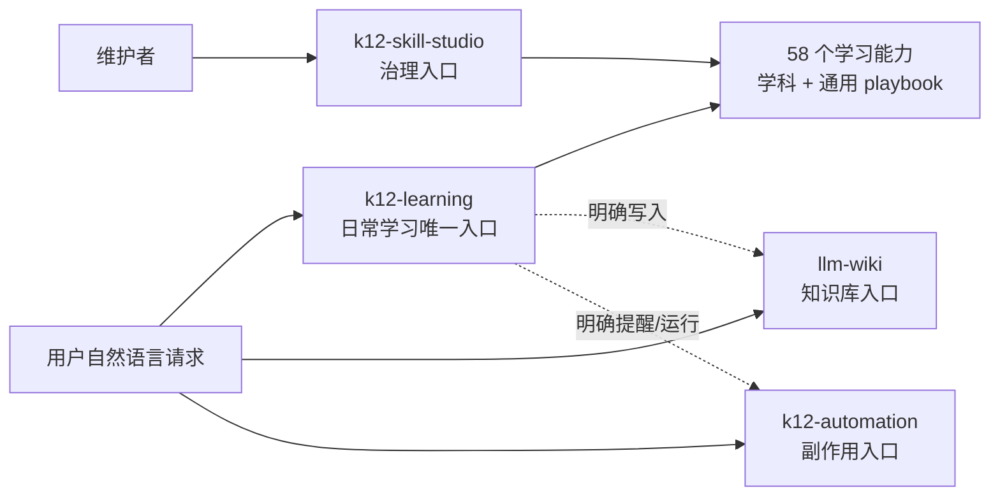

# 四 Product Module 架构

> 适用版本：**V3.0**

## 结论

仓库只向宿主暴露 4 个产品入口，不再暴露 63 个平级 Skill。旧能力没有消失，而是成为模块内部按需加载的 playbook。



## 为什么是四个

划分依据不是“能力数量”，而是稳定的产品边界：

1. `k12-learning` 拥有教学判断和会话内学习结果。
2. `llm-wiki` 拥有持久知识库结构、来源、索引和日志。
3. `k12-automation` 拥有真实副作用、授权记录和确定性运行时。
4. `k12-skill-studio` 拥有模块/playbook 的开发与质量治理。

学习 DNA、跨学科侦探、四部/四步解题法、错题本、费曼学习和各学科教练都属于“如何完成学习任务”，没有独立的安装、权限或运行边界，因此留在 `k12-learning` 内部。新增方法通常也应新增或扩展 playbook，而不是新增 Product Module。

## 模块契约

### `k12-learning`

- 输入：当前问题、材料、学生已做步骤、期望结果。
- 输出：解释、提示、练习、反馈、会话内画像或待确认的持久化建议。
- 内部路由：一个主 playbook，必要时最多两个辅助 playbook。
- 首次启动：明确第一次使用时，以 `student-quick-assessment` 为主、`learning-dna` 为辅；一份真实材料经过 1–3 个短动作后形成会话内初版 DNA，并立即进入真实任务。
- 用户引导：询问能力或平时说法时由 `system-guide` 给自然语言示例，不暴露内部菜单；若同时明确首次使用，仍回到材料驱动的首次启动。
- 组合 owner：`k12-learning` 主流程直接组合方法，不设置内部协调器或方法间交接。
- 默认副作用：无。首次可在会话内生成初版 DNA，但不自动跨会话持久化、提醒、外传或写 Wiki。
- 能力地图：`skills/k12-learning/references/capability-map.json`。

典型组合：

| 用户目标 | 主 playbook | 可选辅助 |
|---|---|---|
| 第一次使用 | `student-quick-assessment` | `learning-dna` + 当前材料对应的学科 playbook |
| 单道物理题卡住 | `physics-problem-coach` | `science-solving-four-steps` |
| 讲懂后验证是否真会 | 学科概念 playbook | `feynman-learning` |
| 反复犯同类错 | 学科 `error-dna` | `correction-notebook` |
| 做跨学科项目 | `cross-subject-detective` | 对应学科 playbook |
| 没有明确任务、想定位 | `student-quick-assessment` | 会话内初版 DNA；获授权后才形成跨会话 Learning State |

### `llm-wiki`

- 采用 `100-Raw / 200-Wiki / 300-Output / 999-Assets` 四层结构。
- `200-Wiki/SCHEMA.md` 是命名、frontmatter 和 taxonomy 的单一来源。
- 新建、迁移、批量入库、删除和安装依赖前先确认路径与范围。
- 不自动读取 K12 Learning State；只接收当前材料或明确授权的最小摘要。

### `k12-automation`

- 提醒通过宿主 adapter 执行；没有 adapter 时只给计划，不谎报成功。
- 夜间产线、OCR、看板和控制台位于 `scripts/nightline/`。
- 夜间教学只读取 `k12-learning` 提供的版本化分析 adapter，不依赖内部 playbook 路径。
- Automation 授权与运行状态独立保存；不创建或拥有 Learning profile。
- 本地建档、外部模型和 OCR 是三个独立授权门。
- 数据根与模块安装目录分离；服务只绑定 `127.0.0.1`。

### `k12-skill-studio`

- 只面向维护者，不参与学生日常答疑。
- 优先深化现有 module；新 Product Module 必须通过 deletion test。
- 负责 source mapping、行为用例、Schema、S1–S8 质量评分和发布前回归。

## 关键领域对象

- **Product Module**：宿主可发现、可安装、有独立边界的 4 个入口。
- **Playbook**：模块内部的方法实现；不能被宿主当作 Skill 发现。
- **Capability Map**：自然语言意图到学习 playbook 的受测映射。
- **Learning State**：经授权保存的最小学习状态，不等于聊天历史。
- **Adapter**：提醒、模型、OCR、文件系统等真实外部执行接口。

完整定义见 [`CONTEXT.md`](../CONTEXT.md)，决策记录见 [`adr/0001-four-product-modules.md`](adr/0001-four-product-modules.md)。

## 迁移与删除证明

- 63 条旧入口映射记录在 [`legacy-skill-mapping.json`](legacy-skill-mapping.json)：其中 62 条可由固定 Git 快照复现，`k12-learning-router` 仅有迁移前审计记录并被显式标为 audit-only。
- 旧教学流程、references、schemas、assets 与测试先迁移，校验后才删除旧 `SKILL.md`。
- 当前保留 61 个内部 playbook：58 个学习、1 个提醒、2 个维护者 playbook。
- 新 `llm-wiki` 以用户提供的新版本为基线，旧 `educational-llm-wiki` 只保留迁移映射。

## 架构不变量

1. `find skills -name SKILL.md` 必须恰好返回四项。
2. `references/playbooks/` 下不得出现 `SKILL.md`。
3. 真实副作用只由 `k12-automation` 或经声明的 adapter 执行。
4. 未经确认，不形成长期状态、不外传、不安装依赖。
5. 新能力优先进入 Capability Map 和 playbook；新增第 5 个模块必须先更新上下文、ADR 和测试。

运行 `bash pipeline/review.sh all` 会验证上述边界、Schema 和自动化运行时。

路由 fixture 的离线契约检查使用：

```bash
node pipeline/run_v3_route_regression.mjs --contract-only
```

需要让真实 Codex 对自然语言请求作出完整 decision 时，显式选择用例或运行全量回归：

```bash
node pipeline/run_v3_route_regression.mjs --case first-use-onboarding --case science-mastery --model gpt-5.6-terra
node pipeline/run_v3_route_regression.mjs --all --model gpt-5.6-terra
```

live 回归会产生模型调用，因此不作为普通静态提交门自动执行。
