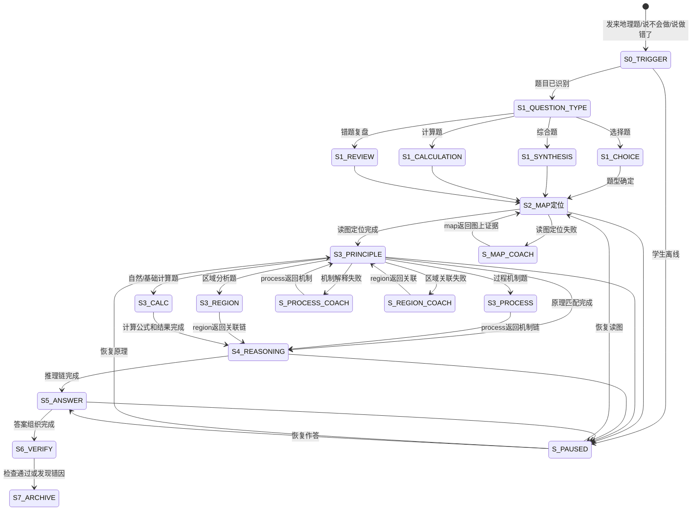

# 地理四步解题法 · 状态机定义

> 本文档定义 `geography-problem-coach` 核心工作流（读图定位→调用原理→逻辑推理→规范作答）的完整状态转移逻辑。

---

## 一、状态总览



---

## 二、状态定义

### S0_TRIGGER — 触发识别

| 项 | 说明 |
|---|---|
| 进入条件 | 学生发来地理题、图表、材料、选项，或说"不会做/做错了/大题没思路" |
| AI动作 | 识别题面、图表、设问、选项、学生答案和卡点 |
| 学生预期动作 | 提供题目和自己的尝试 |
| 退出条件 | 题面可读、任务明确 → S1_QUESTION_TYPE |
| 降级路径 | 图或题面不全 → 请求补充设问、图例、选项或学生答案 |

### S1_QUESTION_TYPE — 题型判别

| 项 | 说明 |
|---|---|
| AI动作 | 判断选择题、综合题、计算题、错题复盘或专项训练 |
| 判别规则 | 有选项→选择题；有材料和开放设问→综合题；出现公式/单位/时区/比例尺→计算题；学生说错了→复盘 |
| 退出条件 | 题型确定，进入相应子分支后统一进入 S2 |

#### S1_CHOICE — 选择题子分支

| 项 | 说明 |
|---|---|
| 重点 | 限定词、图上证据、区域位置、选项陷阱 |
| 初始动作 | 标出"正确/不正确/最符合/主要原因/直接原因"等设问词 |
| 常见错误 | 看见熟悉表述就选，不回到图和区域条件 |

#### S1_SYNTHESIS — 综合题子分支

| 项 | 说明 |
|---|---|
| 重点 | 描述、分析、说明、评价、措施等设问动词 |
| 初始动作 | 先拆设问动词，再判断是过程、区域、比较还是措施 |
| 常见错误 | 不分问法，所有小问都写成原因 |

#### S1_CALCULATION — 计算题子分支

| 项 | 说明 |
|---|---|
| 重点 | 条件、公式、单位、日期或等值距 |
| 初始动作 | 判断时区、比例尺、太阳高度、人口密度或相对高度 |
| 常见错误 | 单位不统一、东加西减反、太阳直射纬度取错 |

### S2_MAP定位 — Step 1：读图定位

| 项 | 说明 |
|---|---|
| 核心原则 | 无图不题。图读错，后续原理和答案都可能错 |
| AI动作 | 要求学生读图名、图例、比例尺/方向、位置、关键数值和异常 |
| 学生预期动作 | 用一句话给出图型、位置和至少一条图上证据 |
| 退出条件 | 读图定位基本正确 → S3_PRINCIPLE |
| 失败处理 | 转 S_MAP_COACH，调用 geography-map-coach |

### S3_PRINCIPLE — Step 2：调用原理

| 项 | 说明 |
|---|---|
| 核心原则 | 原理必须服务于图上证据和设问，不脱离题目背诵 |
| AI动作 | 判断应调用过程机制、区域分析、区位结构或计算公式 |
| 学生预期动作 | 说出相关原理，并解释为什么适用 |
| 退出条件 | 原理与设问匹配 → S4_REASONING |
| 失败处理 | 机制不清 → S_PROCESS_COACH；区域关联不清 → S_REGION_COACH；概念混淆标记 G2 风险 |

### S4_REASONING — Step 3：逻辑推理

| 项 | 说明 |
|---|---|
| 核心原则 | 答案必须有"证据→原理→结论"链条 |
| AI动作 | 要求学生把图上证据、地理原理和题目结论连起来 |
| 学生预期动作 | 写出因果链、比较链、措施对应链或计算步骤 |
| 退出条件 | 推理链不跳步 → S5_ANSWER |
| 失败处理 | 标记 G3/G4/G5 风险，回到对应专项 |

### S5_ANSWER — Step 4：规范作答

| 输出类型 | 结构 |
|----------|------|
| 描述题 | 位置/方向/数值/范围 + 图上证据 |
| 分析题 | 现象 + 因子 + 机制 + 结果 |
| 评价题 | 有利 + 不利 + 条件/限制 + 结论 |
| 措施题 | 问题 + 原因 + 对应措施 + 作用路径 |
| 计算题 | 公式 + 代入 + 单位 + 结果 + 合理性检查 |

### S6_VERIFY — 答案检查

| 检查项 | 通过标准 |
|--------|----------|
| 读图 | 图例、方向、数值、位置无误 |
| 原理 | 原理适用，学段边界合适 |
| 推理 | 因果链、比较链、措施链不跳步 |
| 表达 | 地理术语规范，分点清楚 |
| 计算 | 公式、单位、日期、数量级正确 |
| 价值维度 | 只评价论证链和学科依据，不裁判个人立场 |

### S7_ARCHIVE — 复盘与归档

| 项 | 说明 |
|---|---|
| 正确题 | 给出换图型、换区域或换条件的迁移题 |
| 错题 | 定位错在 S2/S3/S4/S5/S6 哪一步 |
| 归档 | 经同意推送 geography-error-dna，或通过 correction-notebook 统一入口记录 |

---

## 三、状态持久化字段

```json
{
  "flowId": "geography-problem-20260615-001",
  "currentStep": "S3_PRINCIPLE",
  "questionInfo": {
    "subject": "地理",
    "questionType": "综合题",
    "topic": "河流流域开发",
    "gradeBand": "高中",
    "source": "作业"
  },
  "mapReading": {
    "mapType": "区域图+统计图",
    "location": "某河流中下游",
    "evidence": ["支流汇入", "城市沿河分布", "下游地势低平"],
    "mapReady": true
  },
  "principle": {
    "mode": "区域分析",
    "linkedSkill": "geography-region-analyzer",
    "concepts": ["流域开发", "防洪", "航运", "水资源利用"]
  },
  "reasoning": {
    "chainReady": false,
    "missingStep": "下游地势低平与洪涝风险的机制未写清"
  },
  "errorInfo": {
    "hasError": true,
    "suspectedDimension": "G4 区域综合分析错误"
  }
}
```

---

## 四、分支场景速查

| 场景 | 当前状态 | 转移 |
|------|----------|------|
| 学生没读图就答题 | S2 | 停止后续分析，要求先读图名图例和位置 |
| 等值线读反 | S2 | 转 geography-map-coach |
| 只写"受地形影响" | S3/S4 | 转 geography-process-explainer，要求机制链 |
| 区域题只罗列要素 | S3/S4 | 转 geography-region-analyzer，建立要素关联 |
| 计算题单位混乱 | S3_CALC/S6 | 转 natural-calculation 手册自检 |
| 学生同类错题第3次 | S7 | 经同意转 geography-error-dna 做顽固弱项 |

---

## 五、题型分支输出模板

### 选择题

```text
题干限定：
  图型：
  区域：
  设问词：

图上证据：
  证据1：
  证据2：

选项排除：
  A：保留/排除，理由：
  B：保留/排除，理由：
  C：保留/排除，理由：
  D：保留/排除，理由：

回代验证：
  最佳选项是否同时符合图证、区域和原理？
```

### 综合题

```text
设问类型：[描述/分析/说明/评价/措施]
读图证据：
  1.
  2.
调用原理：
  [过程机制/区域分析/区位条件/人地协调]
推理链：
  证据 → 因子 → 机制 → 结论
规范答案骨架：
  ①
  ②
  ③
```

### 计算题

```text
计算类型：
已知条件：
公式：
单位统一：
代入过程：
结果：
合理性检查：
```
