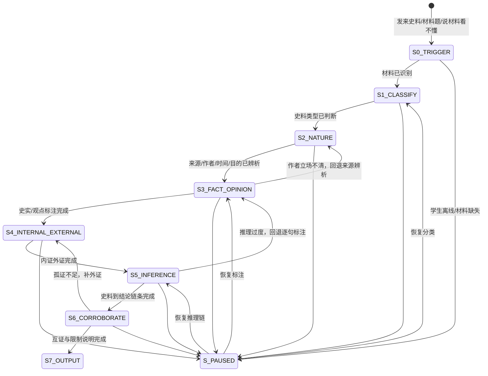

# 史料分析状态机定义

> 本文档定义 `history-evidence-analysis` 的核心工作流，覆盖"史料分类→性质辨析→内证外证→论从史出→孤证不立/互证→输出"全流程及中断恢复。

---

## 一、状态总览



---

## 二、状态定义

### S0_TRIGGER — 触发识别

| 项 | 说明 |
|---|---|
| 进入条件 | 学生发来材料题、史料片段、图片、出处，或说"这段材料看不懂""这条史料能证明什么" |
| AI动作 | 识别材料文字、题目要求和出处信息；判断是否需要先做OCR或让学生补充 |
| 学生预期动作 | 提供材料、题目设问、出处和自己的初步判断 |
| 退出条件 | 材料和题目要求基本可读 → S1_CLASSIFY |
| 降级路径 | 材料缺失或图片不清 → 请求补充题面/出处/关键句，不臆造 |

### S1_CLASSIFY — 史料分类

| 项 | 说明 |
|---|---|
| 核心原则 | 分类不是形式题，分类决定可信度和使用方式 |
| AI动作 | 引导学生判断一手/二手、文献/实物/图像/口述、有意/无意 |
| 学生预期动作 | 先给出分类和理由 |
| 退出条件 | 能说明材料类型及至少一个判断依据 |
| 追问 | "它离事件现场有多近？是亲历记录还是后人叙述？" |

### S2_NATURE — 性质与立场辨析

| 项 | 说明 |
|---|---|
| 核心原则 | 史料不等于真相本身，必须看作者、时间、目的和立场 |
| AI动作 | 检查作者身份、写作时间、写作对象、保存目的、可能立场 |
| 学生预期动作 | 标出可信点与可能偏向 |
| 退出条件 | 能说出"可信在哪里、局限在哪里" |
| 常见回退 | 学生只说"可信/不可信" → 追问具体依据 |

### S3_FACT_OPINION — 史实/观点标注

| 项 | 说明 |
|---|---|
| 核心原则 | 史实可作为证据，观点要辨析；混合句必须拆开 |
| AI动作 | 要求学生逐句或逐短语标注：史实、观点、推论、混合 |
| 学生预期动作 | 给每一句标类型并说明理由 |
| 退出条件 | 材料核心句完成标注 |
| 失败回退 | 把观点当史实 → 回到S2看作者立场 |

### S4_INTERNAL_EXTERNAL — 内证外证

| 项 | 说明 |
|---|---|
| 内证 | 材料内部的时间、地点、人物、数字、措辞、逻辑矛盾 |
| 外证 | 课本史实、其他史料、考古发现、统计数据、同期记录 |
| AI动作 | 引导学生找材料内部证据，再调用已知史实验证 |
| 学生预期动作 | 标出证据句和外部参照 |
| 退出条件 | 能说明材料内部证据与外部史实是否一致 |

### S5_INFERENCE — 论从史出

| 项 | 说明 |
|---|---|
| 核心原则 | 结论必须从材料推出，不能从记忆直接跳到答案 |
| AI动作 | 要求学生说出"材料句子→解释→结论"链条 |
| 学生预期动作 | 写出有限结论 |
| 退出条件 | 推理链不跳步，且不过度推出 |
| 常见错误 | 材料只能证明局部现象，却推出整体趋势 |

### S6_CORROBORATE — 孤证不立/互证

| 项 | 说明 |
|---|---|
| 核心原则 | 单条史料通常只能支持有限结论，重大结论需要互证 |
| AI动作 | 追问需要哪类材料互证：同类、不同来源、考古、统计、官方/民间对照 |
| 学生预期动作 | 提出至少一种互证材料或说明孤证限制 |
| 退出条件 | 能说清是否足以立论及其限制 |

### S7_OUTPUT — 输出与复盘

| 项 | 说明 |
|---|---|
| 输出内容 | 史料类型、可信点、局限、史实/观点标注、证据链、互证建议、易错预警 |
| 归档 | 经同意后可把H2错误推送至 history-error-dna |
| 结束标准 | 学生能独立复述"这条材料能证明什么、不能证明什么" |

### S_PAUSED — 中断/离线

| 项 | 说明 |
|---|---|
| 进入条件 | 任一状态中学生离线、材料缺失或主动暂停 |
| 持久化字段 | 当前材料摘要、已判断类型、已标注句子、待验证结论 |
| 恢复话术 | "上次我们分析到[状态]，你已经判断它是[类型]，接下来继续标史实和观点？" |

---

## 三、状态持久化字段

```json
{
  "flowId": "history-evidence-20260615-001",
  "currentStep": "S3_FACT_OPINION",
  "sourceInfo": {
    "subject": "历史",
    "topic": "洋务运动",
    "sourceType": "文献史料",
    "primaryOrSecondary": "一手",
    "intentionality": "有意史料",
    "author": "官员奏折",
    "createdAt": "19世纪后期",
    "sourceContext": "清政府自强运动相关材料"
  },
  "classificationProgress": {
    "completed": true,
    "studentReason": "奏折接近当时决策现场，但有向皇帝说明政绩的动机"
  },
  "factOpinionMarks": [
    {
      "sentence": "开办机器局以制洋器",
      "type": "史实",
      "reason": "描述具体政策行动"
    },
    {
      "sentence": "足以自强",
      "type": "观点",
      "reason": "作者对政策效果的判断"
    }
  ],
  "inferenceProgress": {
    "claim": "洋务派重视学习西方军事技术",
    "evidence": "开办机器局以制洋器",
    "limit": "不能单独证明洋务运动实现国家富强"
  },
  "corroborationNeeded": ["其他洋务企业资料", "战后效果材料", "财政投入记录"],
  "lastActiveAt": "2026-06-15T20:00:00+08:00"
}
```

---

## 四、分支场景速查

| 场景 | 当前状态 | 转移 |
|------|----------|------|
| 学生直接写课本结论 | S5 | 回退S3，要求找材料原句 |
| 学生把作者评价当事实 | S3 | 回退S2，辨析作者立场 |
| 材料出处缺失 | S0/S1 | 降级：只做文本内部分析，并声明可信度判断受限 |
| 单条材料推出宏大结论 | S5/S6 | 标记过度推断，要求互证 |
| 多条材料冲突 | S6 | 比较来源、时间、作者立场和证据范围 |
| 图片材料看不懂 | S1 | 先分类图像史料，再看图像元素、说明文字和背景 |
| 考古实物不会分析 | S1/S4 | 判断无意史料，强调能证明物质文化但解释需外证 |

---

## 五、学段适配规则

| 学段 | 分类要求 | 辨析要求 | 输出要求 |
|------|----------|----------|----------|
| 初中 | 能判断文献/图片/实物和史实/观点 | 了解作者和时间即可 | 用材料一句话支撑结论 |
| 高中 | 判断一手/二手、有意/无意、多源互证 | 分析作者立场、写作目的、时代语境 | 写出证据链、限度和互证需求 |

---

## 六、错误归档映射

```text
S1 分类错误 → H22 史料性质误判
S2 立场忽略 → H24 作者立场忽略
S3 史实/观点混淆 → H21 史论不分
S4 内外证不足 → H25 内证外证缺失
S5 过度推断/曲解材料 → H23 曲解史料
S6 单证据推出宏大结论 → H26 孤证立论

归档时同步推送至：
  → history-error-dna（深度分类+顽固弱项追踪，经同意）
  → history-problem-coach（材料题流程修正）
  → learning-dna（史料实证能力维度，经同意）
```
