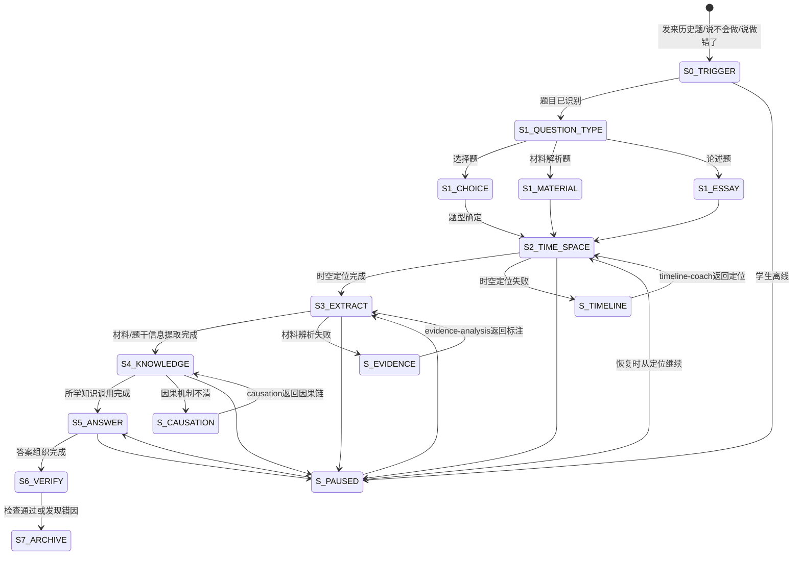

# 历史四步解题法 · 状态机定义

> 本文档定义 `history-problem-coach` 核心工作流（读题定位时空→提取材料信息→调用课本知识→组织答案）的完整状态转移逻辑。

---

## 一、状态总览



---

## 二、状态定义

### S0_TRIGGER — 触发识别

| 项 | 说明 |
|---|---|
| 进入条件 | 学生发来历史题、材料题图片、选择题选项，或说"这道历史题不会/做错了/大题没思路" |
| AI动作 | 识别题面、设问、材料、选项、学生答案和卡点 |
| 学生预期动作 | 提供题目和自己的尝试 |
| 退出条件 | 题面可读、任务明确 → S1_QUESTION_TYPE |
| 降级路径 | 题面不全 → 请求补充设问、材料、选项或学生答案 |

### S1_QUESTION_TYPE — 题型判别

| 项 | 说明 |
|---|---|
| AI动作 | 判断选择题、材料解析题、论述题或错题复盘 |
| 判别规则 | 有选项→选择题；有材料和"根据材料"→材料解析题；要求论述/评析/自拟论题→论述题 |
| 退出条件 | 题型确定，进入相应子分支后统一进入S2 |

#### S1_CHOICE — 选择题子分支

| 项 | 说明 |
|---|---|
| 重点 | 限定词、时空、选项陷阱 |
| 初始动作 | 标出"正确/不正确/最符合/主要原因/直接原因"等设问词 |
| 常见错误 | 看见熟悉表述就选，不回到题干限制 |

#### S1_MATERIAL — 材料题子分支

| 项 | 说明 |
|---|---|
| 重点 | 出处、设问动词、材料关键词 |
| 初始动作 | 先读设问，再读出处，再读材料 |
| 常见错误 | 不读材料直接背课本 |

#### S1_ESSAY — 论述题子分支

| 项 | 说明 |
|---|---|
| 重点 | 观点、史实、论证结构 |
| 初始动作 | 判断是否需要自拟论题、评析观点或结合史实说明 |
| 常见错误 | 观点空泛、史实堆砌、论证断裂 |

### S2_TIME_SPACE — Step 1：读题定位时空

| 项 | 说明 |
|---|---|
| 核心原则 | 任何题先定位时空。定位不清，后面全可能错 |
| AI动作 | 要求学生回答时代、空间、前后节点、同期背景 |
| 学生预期动作 | 用一句话完成时空定位 |
| 退出条件 | 时空定位基本正确 → S3_EXTRACT |
| 失败处理 | 转入 S_TIMELINE，调用 history-timeline-coach |

### S3_EXTRACT — Step 2：提取材料/题干信息

| 项 | 说明 |
|---|---|
| 核心原则 | 材料题先读材料，选择题先抓限定词，论述题先抓观点要求 |
| AI动作 | 引导圈关键词、标史实/观点、提取设问动词 |
| 学生预期动作 | 给出3-5个关键词或证据句 |
| 退出条件 | 信息提取能回应设问 → S4_KNOWLEDGE |
| 失败处理 | 转入 S_EVIDENCE，调用 history-evidence-analysis |

### S4_KNOWLEDGE — Step 3：调用课本知识

| 项 | 说明 |
|---|---|
| 核心原则 | 课本知识必须服务于材料和设问，不能脱离题目背诵 |
| AI动作 | 追问对应章节、阶段特征、概念术语、因果框架 |
| 学生预期动作 | 说出相关知识点并解释为什么相关 |
| 退出条件 | 材料信息和所学知识建立连接 → S5_ANSWER |
| 失败处理 | 因果不清 → S_CAUSATION；概念术语不清 → 标记H4风险 |

### S5_ANSWER — Step 4：组织答案

| 项 | 说明 |
|---|---|
| 选择题输出 | 排除理由 + 最佳选项 + 回代验证 |
| 材料题输出 | 分点作答，每点包含材料信息和所学知识 |
| 论述题输出 | 观点 + 史实依据 + 论证 + 总结 |
| 退出条件 | 答案结构完整，进入S6检查 |

### S6_VERIFY — 答案检查

| 检查项 | 通过标准 |
|--------|----------|
| 时空 | 没有朝代、阶段、地域错位 |
| 材料 | 结论能回扣材料或题干 |
| 知识 | 术语准确，概念不混 |
| 结构 | 分点清楚，史论结合 |
| 价值评价 | 只评价论证链条，不裁判立场 |

### S7_ARCHIVE — 复盘与归档

| 项 | 说明 |
|---|---|
| 正确题 | 给出迁移题或同类题检查 |
| 错题 | 定位错在S2/S3/S4/S5哪一步 |
| 归档 | 经同意推送 history-error-dna，或通过 correction-notebook 统一入口记录 |

---

## 三、状态持久化字段

```json
{
  "flowId": "history-problem-20260615-001",
  "currentStep": "S4_KNOWLEDGE",
  "questionInfo": {
    "subject": "历史",
    "questionType": "材料解析题",
    "topic": "鸦片战争",
    "gradeBand": "高中",
    "source": "作业"
  },
  "timeSpace": {
    "era": "中国近代史开端",
    "time": "1840年前后",
    "space": "中国东南沿海/英国",
    "previousNode": "工业革命后英国海外扩张",
    "nextNode": "《南京条约》及近代中国社会变化"
  },
  "extraction": {
    "keywords": ["工业革命", "市场", "禁烟", "战争"],
    "factOpinionMarks": ["禁烟为史实", "维护贸易为英国立场"],
    "questionVerb": "分析原因"
  },
  "knowledgeLink": {
    "concepts": ["工业资本主义扩张", "半殖民地半封建社会"],
    "causalChainReady": false
  },
  "answerProgress": {
    "outline": [],
    "needsCausationSupport": true
  },
  "errorInfo": {
    "hasError": true,
    "suspectedDimension": "H3 历史解释错误"
  }
}
```

---

## 四、分支场景速查

| 场景 | 当前状态 | 转移 |
|------|----------|------|
| 学生没定位时空就答题 | S2 | 停止后续分析，要求先回答何时何地 |
| 学生材料题直接背课本 | S3 | 要求划材料关键词，必要时联动 evidence |
| 学生原因题把导火索当根本原因 | S4 | 联动 causation 做因果分层 |
| 学生选择题纠结两个选项 | S5/S6 | 回到题干限定词和时空排除 |
| 学生论述题没有观点 | S5 | 先生成可论证观点，再选史实 |
| 学生只要答案 | 任一状态 | 可给简答，但说明不会进入完整训练 |
| 学生同类错题第3次 | S7 | 经同意转 history-error-dna 做顽固弱项 |

---

## 五、题型分支输出模板

### 选择题

```text
题干限定：
  时间：
  空间：
  设问词：

选项排除：
  A：保留/排除，理由：
  B：保留/排除，理由：
  C：保留/排除，理由：
  D：保留/排除，理由：

最佳选项：
  [选项]，因为[与题干限定最吻合]
```

### 材料解析题

```text
材料信息：
  关键词：
  史实句：
  观点句：

所学知识：
  对应阶段：
  相关概念：

答案结构：
  ① 材料说明……，结合所学可知……
  ② 材料中的……反映了……
```

### 论述题

```text
观点：
  [一句可论证判断]

论证：
  史实1：[时间+事件+空间] → 说明：
  史实2：[时间+事件+空间] → 说明：

总结：
  回扣观点，说明历史条件或影响。
```

---

## 六、错误归档映射

```text
S2 时空定位错误 → H1
  朝代错位/中外错位/序列倒置

S3 材料提取错误 → H2
  史论不分/曲解史料/史料性质误判/孤证立论

S4 知识连接错误 → H3或H4
  因果错位/阶段特征错误/概念术语混淆

S5 答案组织错误 → H3或H5
  解释链断裂/评价无依据/只给态度无史实

归档目标：
  → correction-notebook 统一入口
  → history-error-dna 深度分类（经同意）
```
