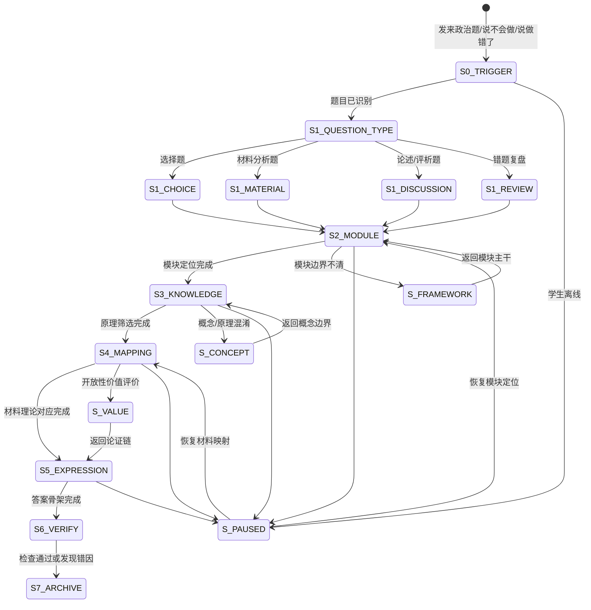

# 政治理论联系实际四步法 · 状态机定义

> 本文档定义 `politics-application-coach` 核心工作流（定位理论模块→知识调动→对应映射→规范表达）的完整状态转移逻辑。

---

## 一、状态总览



---

## 二、状态定义

### S0_TRIGGER — 触发识别

| 项 | 说明 |
|---|---|
| 进入条件 | 学生发来政治题、材料、选项、答案，或说"不会做/做错了/大题没思路" |
| AI 动作 | 识别题面、材料、设问、选项、学生答案和卡点 |
| 学生预期动作 | 提供题目和自己的尝试 |
| 退出条件 | 题面可读、任务明确 → S1_QUESTION_TYPE |
| 降级路径 | 材料或设问不全 → 请求补充，不补题目 |

### S1_QUESTION_TYPE — 题型判别

| 题型 | 判别规则 | 重点 |
|------|----------|------|
| 选择题 | 有选项，问正确/不正确/最符合 | 限定词、材料主旨、选项陷阱 |
| 材料分析题 | 有材料和说明/分析/为什么/如何 | 模块定位、材料-理论映射 |
| 论述/评析题 | 问评析、谈看法、应不应该、如何评价 | 观点、依据、材料分析、价值论证 |
| 错题复盘 | 学生说做错、不会、答案不一致 | 回溯四步断裂点 |

### S2_MODULE — Step 1：定位理论模块

| 项 | 说明 |
|---|---|
| 核心原则 | 政治题不定位模块不开写 |
| AI 动作 | 要求学生先说设问限定、材料主体、模块判断 |
| 学生预期动作 | 输出"模块→单元→概念→原理"的初判 |
| 退出条件 | 模块和单元基本正确 → S3_KNOWLEDGE |
| 失败处理 | 转 `politics-framework-coach` 或做30秒纯净版审题测试 |

### S3_KNOWLEDGE — Step 2：知识调动

| 项 | 说明 |
|---|---|
| 核心原则 | 原理必须来自已定位模块，并服从设问方向 |
| AI 动作 | 帮学生从主干中筛选2-4条相关原理 |
| 学生预期动作 | 说出原理关键词和适用理由 |
| 退出条件 | 原理与设问匹配 → S4_MAPPING |
| 失败处理 | 概念混淆转 `politics-concept-explainer`，标记 Po2 风险 |

### S4_MAPPING — Step 3：对应映射

| 项 | 说明 |
|---|---|
| 核心原则 | 每条理论必须有材料证据 |
| AI 动作 | 要求学生圈主体、行为、结果、价值目标，并建立对应表 |
| 学生预期动作 | 写出"材料词句→原理→分析句" |
| 退出条件 | 映射不跳步 → S5_EXPRESSION |
| 失败处理 | 标记 Po3 风险；开放性价值题转 `politics-value-reasoning` |

### S5_EXPRESSION — Step 4：规范表达

| 答案类型 | 结构 |
|----------|------|
| 原因/意义 | 材料现象 + 理论依据 + 影响/意义 |
| 措施/建议 | 问题 + 主体行动 + 理论依据 + 效果 |
| 体现类 | 材料句 + 体现的原理 + 简短说明 |
| 评析类 | 事实判断 + 学科标准 + 价值判断 + 选择建议 |
| 选择题 | 排除理由 + 保留理由 + 回代验证 |

### S6_VERIFY — 答案检查

| 检查项 | 通过标准 |
|--------|----------|
| 模块 | 与设问限定一致，无跨模块乱答 |
| 原理 | 概念准确，适用条件满足 |
| 映射 | 每个答案点能找到材料对应 |
| 表达 | 分点清楚，术语规范，逻辑词明确 |
| 价值维度 | 只评价论证链和学科依据，不裁判个人立场 |

### S7_ARCHIVE — 复盘与归档

| 项 | 说明 |
|---|---|
| 正确题 | 给出换时政材料或换设问的迁移题 |
| 错题 | 定位错在 S2/S3/S4/S5/S6 哪一步 |
| 归档 | 经同意推送 `politics-error-dna`，或通过 `correction-notebook` 统一入口记录 |

---

## 三、状态持久化字段

```json
{
  "flowId": "politics-application-20260615-001",
  "currentStep": "S4_MAPPING",
  "questionInfo": {
    "subject": "政治",
    "questionType": "材料分析题",
    "topic": "政务公开与法治政府",
    "gradeBand": "高中",
    "source": "作业"
  },
  "modulePosition": {
    "module": "政治生活",
    "unit": "政府",
    "concepts": ["依法行政", "接受监督", "服务人民"],
    "moduleReady": true
  },
  "knowledge": {
    "principles": ["政府依法行政", "权力需要监督", "建设服务型政府"],
    "selected": ["依法行政", "接受监督"]
  },
  "mapping": {
    "materialClues": ["公开预算", "群众在线反馈", "整改清单"],
    "chainReady": false,
    "missingStep": "群众反馈与权力监督的关系未写清"
  },
  "errorInfo": {
    "hasError": true,
    "suspectedDimension": "Po3 理论联系实际错误"
  }
}
```

---

## 四、分支场景速查

| 场景 | 当前状态 | 转移 |
|------|----------|------|
| 学生没看设问限定就答 | S2 | 停止后续分析，要求先说模块 |
| 经济题答政治主体 | S2/S3 | 回到模块边界，标记 Po1 风险 |
| 商品和产品混淆 | S3 | 转 `politics-concept-explainer` |
| 原理和材料两张皮 | S4 | 建立材料-理论映射表，标记 Po3 风险 |
| 评析题只有态度 | S4/S5 | 转 `politics-value-reasoning`，只练论证不评立场 |
| 同类错题第3次 | S7 | 经同意转 `politics-error-dna` 做顽固弱项 |

---

## 五、题型分支输出模板

### 选择题

```text
设问限定：
材料主体：
理论模块：

选项排除：
  A：保留/排除，理由：
  B：保留/排除，理由：
  C：保留/排除，理由：
  D：保留/排除，理由：

回代验证：
  最佳选项是否同时符合设问限定、材料主旨和教材表述？
```

### 材料分析题

```text
设问类型：[原因/意义/措施/体现/说明]
理论模块：[经济/政治/文化/哲学]
可用原理：
  1.
  2.
材料映射：
  材料句 → 原理 → 分析句
答案骨架：
  ①
  ②
  ③
```

### 论述/评析题

```text
观点：
事实判断：
学科标准：
理论依据：
材料分析：
选择/建议：
价值红线：只评价论证链条完整性，不评价学生个人立场。
```
